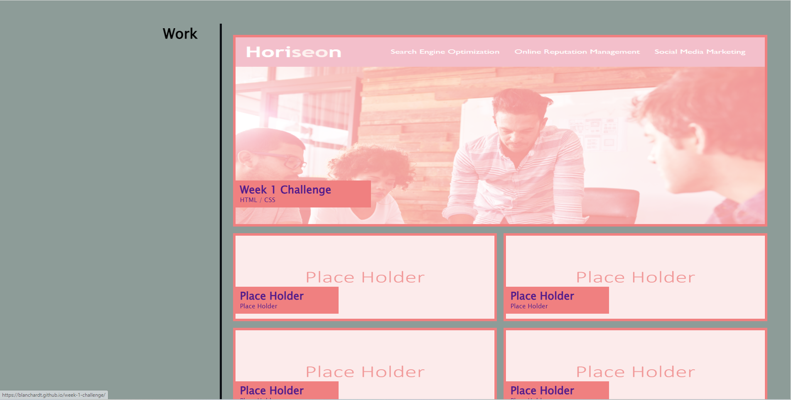
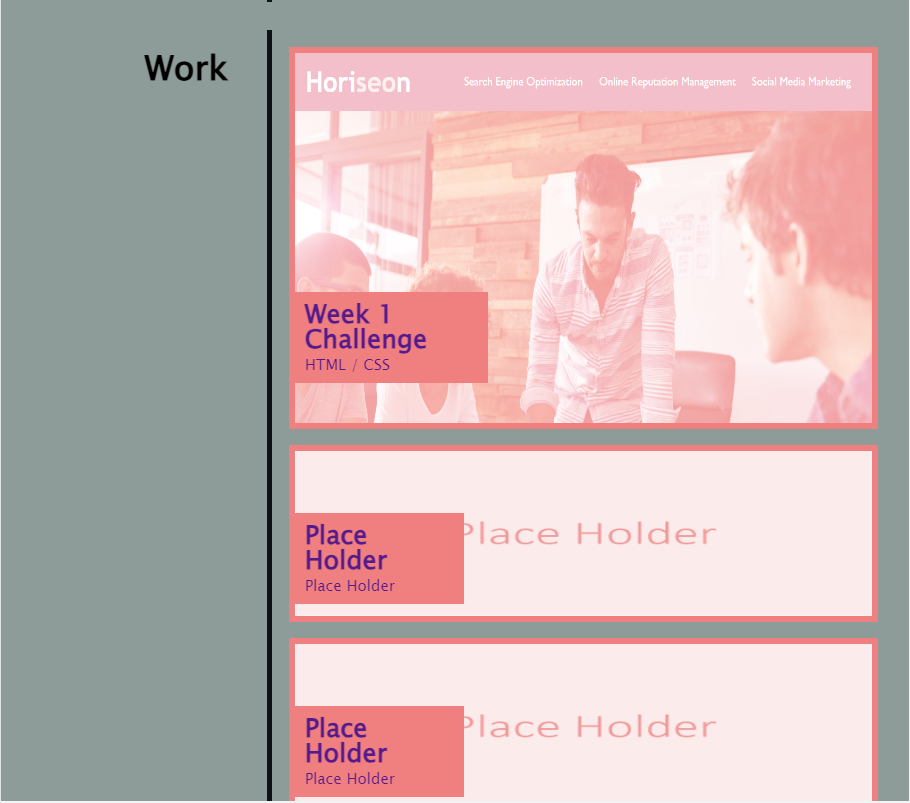

# week-2-challenge
My personal Portfolio  
Create a portfolio about my self for employers to view my work samples.

## Project Description
The page is a responsive webpage and changes as the screen gets smaller.  
Desktop:   
  
  
  

Mobile:  
  
  
  

Using the navigation in the top right of the header, you will be able to quickly navigate to those sections on the page, or download my resume. 
Each image in the "Works" section will act like a link as well to bring you to the live site of that work.  Upon hovering over an image
the overlay will disapear revealing the true colors of the images.

## How to Get to the Page
The link to the repo for this project is located at: https://github.com/blanchardt/week-2-challenge  
You can use this link to get to the live site: https://blanchardt.github.io/week-2-challenge/

## Credits
Modified by: Trevor Blanchard  
index.html:    

line 33:  
Went to https://www.w3schools.com/tags/att_a_download.asp to find info on how to have links download files when clicked on.  
“HTML &lt;a&gt; Download Attribute.” HTML a Download Attribute, www.w3schools.com/tags/att_a_download.asp. 
&nbsp;&nbsp;&nbsp;&nbsp;&nbsp;Accessed 6 July 2023.

line 131:  
Went to https://www.gaintap.com/archives/clickable-website-phone-number-and-call-tracking-guide/ to find info on how to have links call a phone 
number when clicked on.  
Onak, Graham. “How to Create a Click to Call Link Using HTML and in WordPress.” GainTap, 28 July 2021,   
&nbsp;&nbsp;&nbsp;&nbsp;&nbsp;www.gaintap.com/archives/clickable-website-phone-number-and-call-tracking-guide/.

styles.css:  

line 132:  
Went to https://stackoverflow.com/questions/42341479/add-hue-to-a-regular-image-with-css to find info on how to apply a hue over an image.    
user7592255, et al. “Add Hue to a Regular Image with CSS.” Stack Overflow, 28 Feb. 2017, 
&nbsp;&nbsp;&nbsp;&nbsp;&nbsp;stackoverflow.com/questions/42341479/add-hue-to-a-regular-image-with-css.